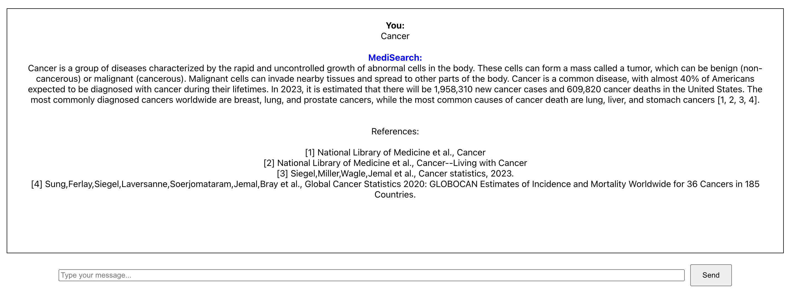

# MediSearch React client example

This repo shows an example integration of the [MediSearch React client](https://www.npmjs.com/package/medisearch_client). To run the code, first make sure that you obtained an API key from the [MediSearch API site](https://medisearch.io/developers). Then, paste your API key on line 11 of `src/MediChat.js` and simply run `npm install && npm run start` from the root of this project in your terminal.

You should see the following chat window in your browser if everythin goes well:

Do not hesitate to contact `founders@medisearch.io` in case you run into any problems or you have any questions.